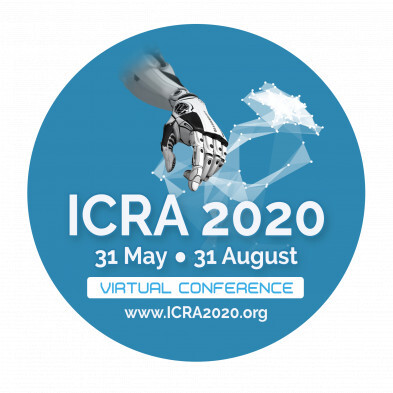

Due to the virtual setting, the ICRA this year will be a bit different. I have to follow the guidelines [here](https://www.icra2020.org/program/practical-information) to get started. Basically, after registration, I need to:

- [x] join the slack channel to interact with the authors
- [x] create an account at InfoVaya to view the presentation videos
- [x] login to Papercept for paper proceedings

I have also created a [repo](https://github.com/moshanATucsd/ICRA-2020-notes) for the ICRA 2020 experience.
